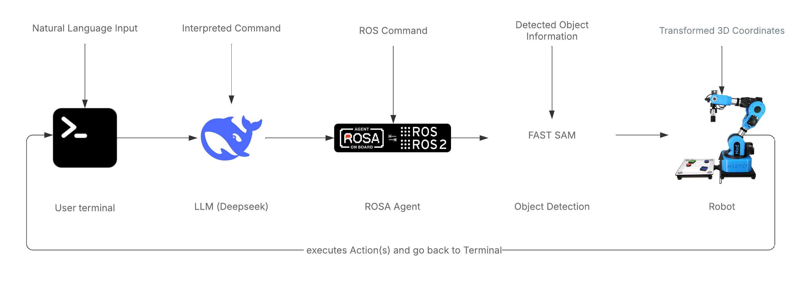

# LLM-Powered Robotic Control for Pick-and-Place Applications

[] [] []

This project demonstrates text-based control of a robot for pick-and-place applications, leveraging the power of Large Language Models (LLMs) to enable intuitive human-robot interaction.

## Table of Contents

*   [Overview](#overview)
*   [Features](#features)
*   [Requirements](#requirements)
*   [Architecture](#architecture)
*   [Acknowledgments](#acknowledgments)
*   [Citing](#citing)
*   [License](#license)

## Overview

The goal of this project is to investigate the feasibility of using LLMs to control a standard 6-axis robot equipped with a horizontal gripper. The focus is on the robot's ability to perform pick-and-place tasks based on natural language input via a terminal.  This enables robot control without specialized programming knowledge.

## Features

*   **Natural Language Control:** The robot can be controlled through simple, natural language commands.
*   **LLM-based Interpretation:** A Large Language Model (Deepseek) is used to interpret user inputs and translate them into executable robot commands.
*   **Pick-and-Place Functionality:** The robot can pick up and place objects based on user instructions.
*   **ROS Integration:** The system is integrated with the Robot Operating System (ROS) for robot control and coordination.
*   **Object Detection:** FastSAM is used for real-time object detection to determine the 3D position of objects.

## Requirements

The system was developed and tested under the following conditions:

*   **Operating System:** Ubuntu 20.04.6 LTS
*   **Python Version:** Python 3.9 or higher
*   **ROS Distribution:** ROS Noetic or higher
*   **ROSA:** Installed according to the documentation at [https://github.com/nasa-jpl/rosa](https://github.com/nasa-jpl/rosa)
*   **Ollama:** Installed according to the documentation at [https://ollama.com/download](https://ollama.com/download)
*   **FastSAM Weights:** Download `FastSAM-x.pt` from [https://github.com/CASIA-IVA-Lab/FastSAM](https://github.com/CASIA-IVA-Lab/FastSAM) and store it in the correct directory (see installation instructions).
*   **Deepseek LLM:** Obtainable via Ollama: `https://ollama.com/MFDoom/deepseek-r1-tool-calling:14b/blobs/9dc201e034e9` (Ensure Ollama is properly configured to download and run the model).
*   **Niryo Roboter** To test the project correctly a Niryo Robot is needed.


## Architecture

The system consists of the following main components:

*   **User Interface:** A terminal for entering natural language commands.
*   **LLM (Deepseek):** Interprets the natural language commands and generates corresponding actions.
*   **ROSA Agent:** Translates the LLM actions into executable ROS commands.
*   **FastSAM:** Detects objects in the robot camera view and provides position information.
*   **Niryo Ned2 Robot:** Executes the ROS commands to perform pick-and-place tasks.



## Acknowledgments

We also acknowledge the work of Florian Gonsior, a student from F08 at TH Köln, who helped us during the project, he has created a concept for a practical application of the project. 
German Version at [https://github.com/Ali-Uen/pickPlaceWithPrompt/blob/main/Praktisches%20Konzept.docx](https://github.com/Ali-Uen/pickPlaceWithPrompt/blob/main/Praktisches%20Konzept.pdf)

We thank Prof. Dr. Daniel Gaida at TH Köln / CPS Lab for supporting us in the development of this project.

## Citing

If you use this work in your research projects, please cite our paper:

```bibtex
@misc{ÜnalKolodziejski2024,
  author = {Ali Ünal and Jan Felipe Ribeiro Kolodziejski},
  title = {LLM-based Robot Control for Pick-and-Place Applications},
  year = {2024},
  url = {https://arxiv.org/pdf/}
}
